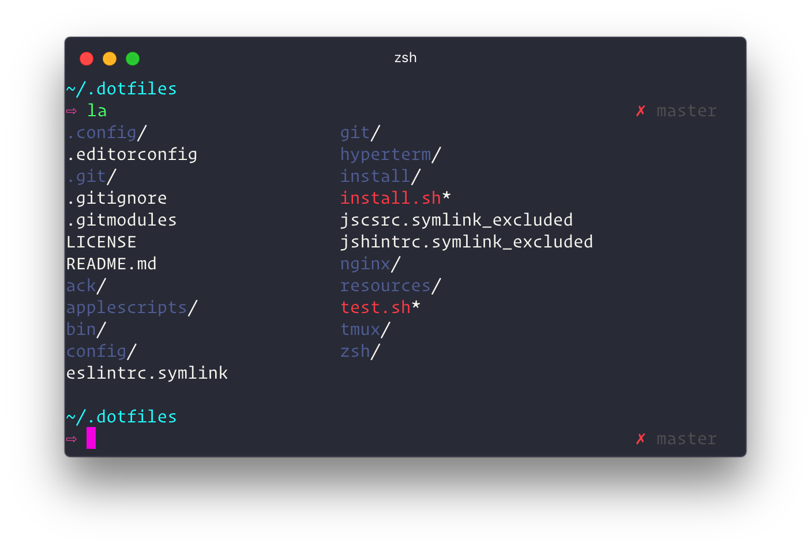

# Dracula theme for [HyperTerm](https://hyperterm.org/)

> A dark theme for [HyperTerm](https://hyperterm.org/).



## Install

Add `hyper-dracula` to the plugins list in your `~/.hyper.js` config file.

```
plugins: [
	"hyper-dracula"
]
```
Restart hyperterm :)

## License

[MIT License](./LICENSE)
